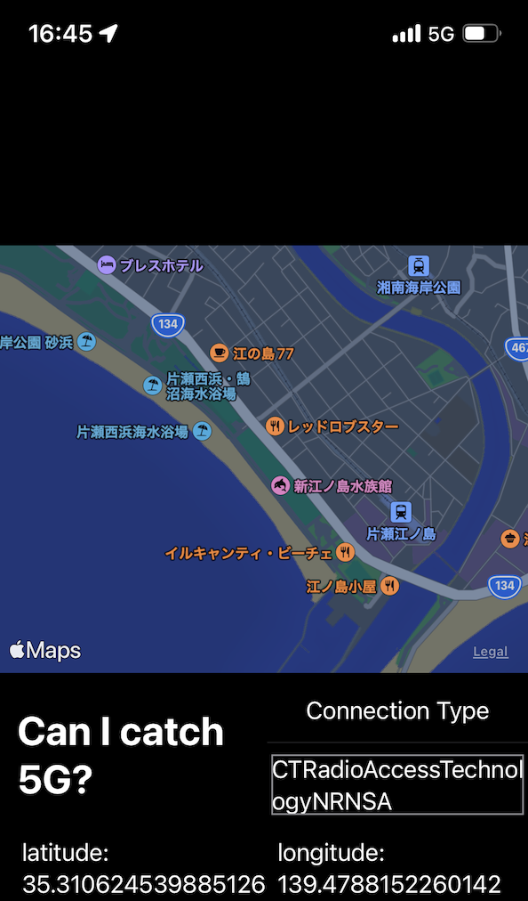

# Terminate Self

A tiny experiment app that shows current connection type and its location

## Sample 

## Tested on

- iPhone 13 mini / iOS 15.1.1
- 1 physical SIM, no carrier for eSIM
- Xcode 13.1
- Mac Book Air (Apple Silicon) / macOS Monterey (12.0.1)

## LICENSE

MIT

